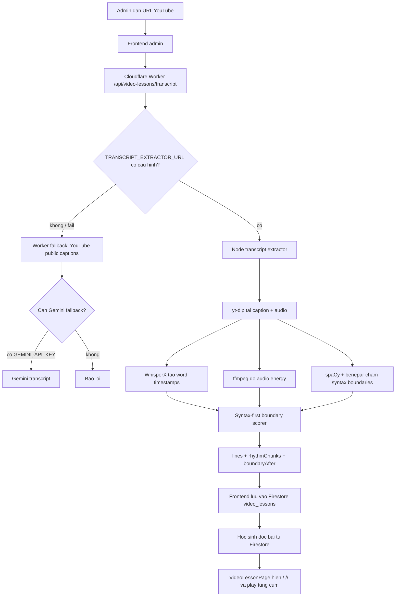

# ReadFlow / Video Lessons - Current System Report

> ⚠️ **SUPERSEDED (2026-06-18).** Tài liệu này mô tả pipeline cũ (WhisperX + ffmpeg + spaCy/benepar server-side extractor + worker transcript). Pipeline đó đã bị **gỡ bỏ** trong đợt dọn dẹp. Kỹ thuật hiện hành = **audio-faithful caption skill**: `scripts/rhythm-from-captions.mjs` + skill `.claude/skills/youtube-rhythm` → publish qua admin "Nhập JSON nhịp" (`importVideoLesson`). Giữ file này làm tư liệu lịch sử. Thiết kế nhịp xem [READFLOW-IMPROVEMENT-PROPOSAL-2026-06-17.md](./READFLOW-IMPROVEMENT-PROPOSAL-2026-06-17.md).

Ngay tao: 2026-06-17

Muc dich: tai lieu nay mo ta trang thai he thong hien tai de Claude hoac mot nguoi review ben ngoai co the doc, nhan xet va de xuat cai tien. Bao cao tap trung vao module Video Lessons / ReadFlow: tao bai tu YouTube, phan tich nhip doc, luu Firestore, giao dien hoc sinh va admin.

## 1. Tom tat ngan

He thong hien tai khong phai dang xay moi tu dau. Da co cac thanh phan chinh:

- React/Vite frontend cho hoc sinh va admin.
- Firebase Auth + Firestore lam nguon du lieu chinh.
- Cloudflare Worker lam API co xac thuc cho cac tac vu AI/content.
- Node transcript extractor local/host rieng de chay `yt-dlp`, `ffmpeg`, `WhisperX` va parser Python.
- Data model `video_lessons` da co `lines` va `rhythmChunks`.
- Giao dien hoc sinh da hien dau `/` va `//`, nghe tung cau, nghe tung cum, lap cau, chinh toc do, che chu, danh dau da thuoc.
- Admin da co man tao bai tu URL YouTube va man xem/sua nhip toi thieu.

Huong hien tai sau dot trien khai moi: he thong tu dong tao nhip bang `WhisperX + syntax-first parser`, dung `ffmpeg` de doc audio/kiem tra energy va fallback khi khong chay duoc WhisperX. Giao vien khong can duyet tay truoc khi hoc sinh thay dau nhip. Admin review van ton tai nhu cong cu sua neu can.

Ket qua smoke test gan nhat voi video `YS7vsBgWszI`:

```text
rhythmSource = whisperx-syntax-v4
syntaxEngine = spacy+benepar_en3_large
target line = This is how it is able to infect the tiny bacterium and the cells in our bodies
target rhythm = This is how / it is able to / infect the tiny bacterium / and the cells in our bodies
```

## 2. Stack va thu muc lien quan

Repo chinh: `D:\co-yen-learns-english`

Thanh phan lien quan:

- `src/`: React frontend.
- `src/pages/VideoLessonsPage.tsx`: danh sach bai video cho hoc sinh.
- `src/pages/VideoLessonPage.tsx`: man hoc video/luyen nhip.
- `src/pages/admin/VideoLessons.tsx`: admin tao bai video tu URL YouTube.
- `src/pages/admin/VideoLessonReview.tsx`: admin xem/sua/xoa/danh dau boundary.
- `src/lib/videoLessons.ts`: type va Firestore API cho video lessons.
- `src/components/YouTubeSegmentPlayer.tsx`: player YouTube iframe co play segment.
- `workers/content-importer/`: Cloudflare Worker API.
- `services/transcript-extractor/`: Node service chay yt-dlp/WhisperX/ffmpeg/parser.
- `services/transcript-extractor/syntax-boundaries.py`: Python syntax parser.
- `scripts/evaluate-rhythm-engines.mjs`: script benchmark so sanh engine.
- `docs/READFLOW-V1.2.md`: spec nang cap truoc do.
- `C:\Users\Truong\.codex\skills\youtube-rhythm-builder\scripts\build_youtube_rhythm.mjs`: script ngoai repo de build/update Firestore bang Firebase Admin.

Package chinh:

- Frontend: React 18, Vite, TypeScript, Tailwind, Firebase Web SDK.
- Backend Worker: Cloudflare Worker + Hono-style router trong `workers/content-importer/src/index.ts`.
- Local extractor: Node 20+, `yt-dlp`, `ffmpeg`, `WhisperX`.
- Syntax parser: Python, `spaCy`, `benepar`, model `en_core_web_sm`, model `benepar_en3_large`.

## 3. Kien truc tong quan



## 4. Data model hien tai

### 4.1 Collection `video_lessons`

Doc id thuong la YouTube video id.

```ts
interface VideoLesson {
  id: string;
  title: string;
  youtubeUrl: string;
  videoId: string;
  source: "caption" | "auto_caption" | "gemini";
  languageCode: string;
  grade: number | null;
  topic: string;
  lines: VideoLessonLine[];
  rhythmSource?: string;
  createdAt?: unknown;
  updatedAt?: unknown;
  createdBy?: string;
}
```

`lines`:

```ts
interface VideoLessonLine {
  id: string;
  start: number;
  end: number;
  text: string;
  vi?: string;
  rhythmChunks?: VideoLessonRhythmChunk[];
}
```

`rhythmChunks`:

```ts
interface VideoLessonRhythmChunk {
  text: string;
  start: number;
  end: number;
  boundaryAfter?: VideoLessonRhythmBoundary;
}

interface VideoLessonRhythmBoundary {
  type: "minor" | "major"; // "/" hoac "//"
  pauseMs: number;
  confidence: number; // 0..1
  sources: Array<"silence" | "punctuation" | "syntax" | "length" | "audio">;
}
```

Quy uoc:

- `boundaryAfter` nam tren chunk ben trai, dai dien dau ngat sau chunk do.
- `minor` hien thi `/`.
- `major` hien thi `//`.
- Chunk cuoi cau thuong khong co `boundaryAfter`.
- Du lieu cu khong co `boundaryAfter` van doc duoc, nhung khong co metadata.

### 4.2 Collection `video_lesson_progress`

Path: `video_lesson_progress/{uid}/lessons/{lessonId}`.

```ts
interface VideoLessonProgress {
  lessonId: string;
  completedLineIds: string[];
  difficultLineIds: string[];
  currentLineIndex: number;
  hideLevelByLine: Record<string, number>;
  updatedAt?: unknown;
}
```

Dung cho:

- Ghi nho cau hien tai.
- Dem % da thuoc.
- Luu muc che chu tung cau.

## 5. Luong tao bai hien tai

### 5.1 Tu UI admin

File chinh:

- `src/pages/admin/VideoLessons.tsx`
- `src/lib/videoLessons.ts`

Luong:

1. Giao vien vao `/admin/video-lessons`.
2. Dan YouTube URL, tuy chon lop va chu de.
3. Frontend goi `createTranscriptFromYouTube(url, { grade })`.
4. Ham nay POST den `${apiBaseUrl()}/api/video-lessons/transcript` kem Firebase ID token va `grade`.
5. Worker kiem tra admin.
6. Worker goi extractor neu `TRANSCRIPT_EXTRACTOR_URL` duoc cau hinh.
7. Frontend nhan preview va goi `saveVideoLesson`.
8. `saveVideoLesson` ghi thang vao Firestore collection `video_lessons` bang Firebase Web SDK.

Luu y: viec ghi Firestore tu frontend phu thuoc Firestore rules. Rules hien cho phep write neu email la admin.

### 5.2 Tu admin review

File chinh:

- `src/pages/admin/VideoLessonReview.tsx`

Chuc nang:

- Load lesson theo id.
- Hien tung cau, chunk, dau `/`/`//`.
- Dem thong ke:
  - tong lines
  - tong chunks
  - tong boundaries
  - low confidence boundaries
  - major boundaries
- Button `Tao lai nhip`:
  - goi lai extractor qua `createTranscriptFromYouTube(url, { grade: lesson.grade })`.
  - kiem tra `preview.videoId` phai khop video hien tai.
  - ghi lai `lines` va `rhythmSource` vao Firestore.
- Button `/`/`//` tren tung boundary:
  - toggle `minor` <-> `major`.
  - day `confidence` len toi thieu 0.95.
- Button thung rac:
  - xoa boundary bang cach merge 2 chunk lien ke.
- Button `Luu review`:
  - ghi `lines`, `rhythmSource`, `rhythmReviewedAt`, `updatedAt`.

Hien tai admin review la cong cu sua truc tiep, chua co workflow ban nhap/publish rieng.

## 6. Transcript extractor local

Thu muc: `services/transcript-extractor/`

Entry:

- HTTP server: `node services/transcript-extractor/server.mjs`
- CLI extract: `node services/transcript-extractor/server.mjs --extract URL`
- Root scripts:
  - `npm run transcript:dev`
  - `npm run transcript:extract -- URL`

Port mac dinh: `8788`.

Env chinh:

```text
PORT=8788
HOST=127.0.0.1
TRANSCRIPT_EXTRACTOR_TOKEN=
YTDLP_BIN=yt-dlp
FFMPEG_BIN=ffmpeg
PYTHON_BIN=python
RHYTHM_ENGINE=whisperx
WHISPERX_BIN=whisperx
WHISPERX_MODEL=large-v3
WHISPERX_DEVICE=cuda
WHISPERX_COMPUTE_TYPE=float16
WHISPERX_BATCH_SIZE=8
```

Chi con 2 engine hop le:

- `whisperx`: mac dinh.
- `ffmpeg`: fallback.

Neu dat engine khac, service reject bang loi.

### 6.1 Download caption va audio

Extractor:

1. Chuan hoa YouTube URL/video id.
2. Tao temp dir.
3. Chay `yt-dlp` de tai metadata, English captions va audio.
4. Chon caption file:
   - uu tien English captions.
   - doc `.json3` hoac `.vtt`.
5. Parse subtitle thanh `lines`.
6. Parse word timings tu json3 neu co.
7. Chon audio file de phan tich.
8. Xoa temp dir sau khi xong.

Neu khong co audio, service bao loi vi ca WhisperX va ffmpeg rhythm deu can audio.

### 6.2 WhisperX path

Khi `RHYTHM_ENGINE=whisperx`:

1. Chay WhisperX tren audio:
   - model `large-v3`
   - language `en`
   - device `cuda`
   - compute type `float16`
   - batch size `8`
   - output JSON
2. Doc `segments[].words[]`.
3. Lay `word/text`, `start`, `end`.
4. Sap xep theo thoi gian.
5. Tra ve word timestamps.

Neu WhisperX khong tra du timestamp dung duoc, service bao loi.

### 6.3 ffmpeg energy path

Bat ke engine la `whisperx` hay `ffmpeg`, code hien tai van chay `analyzeAudioEnergy(audioFile)` de do audio energy.

ffmpeg duoc dung de:

- Decode audio ra PCM 16 kHz mono.
- Cat thanh frame 20 ms.
- Tinh dB/RMS tung frame.
- Phat hien audio dip / pause giua cac word.

Mac dinh:

```text
AUDIO_RHYTHM_SAMPLE_RATE=16000
AUDIO_RHYTHM_FRAME_MS=20
AUDIO_RHYTHM_MIN_PAUSE=0.18
AUDIO_RHYTHM_LOW_DURATION=0.08
AUDIO_RHYTHM_DB_DROP=7
MAX_AUDIO_PCM_BYTES=80000000
```

### 6.4 Syntax parser path

File: `services/transcript-extractor/syntax-boundaries.py`

Parser:

- Input JSON qua stdin: `{ lines: [{ id, text }] }`
- Load `spacy.load("en_core_web_sm")`.
- Add pipe `benepar`, model `benepar_en3_large`.
- Tach token theo whitespace de map dung voi text UI.
- Dung spaCy token/POS/dependency + benepar constituency spans de cham diem boundary giua moi cap tu.

Output moi boundary:

```json
{
  "index": 4,
  "breakScore": 3.0,
  "noBreakScore": 0.0,
  "clean": true,
  "tight": false,
  "depth": 1,
  "sources": ["infinitive-head"],
  "labels": ["TO+VB"]
}
```

Output cua moi line cung co `spans: [{ start, end, label, depth }]` de Node co the biet ranh gioi nam o clause/phrase nao. Neu tokenizer lech, Node khong drop im lang nua ma canh bao va tiep tuc dung phan profile kha dung.

Tin hieu cu phap hien co:

- Constituency:
  - Clause labels `S`, `SBAR`, `SBARQ`, `SINV`, `SQ` tang `breakScore`.
  - Phrase labels `NP`, `VP`, `PP`, `ADJP`, `ADVP`, `WHNP`, `WHADVP` tang nhe `breakScore` o ranh gioi cum.
  - Tight labels `NP`, `PP`, `ADJP`, `ADVP`, `QP`, `PRT` tang `noBreakScore` ben trong cum ngan.
- Dependency/POS:
  - `TO + VB`: tang break sau `to`, giam break truoc `to`.
  - ADP/preposition, `case`, `mark`: giam break sau gioi tu.
  - determiner/possessive/compound/adjective/aux/neg: giam break trong cum chat.
  - clause starters `and`, `but`, `because`, `if`, `when`, `while`, `where`, `which`, `who`, `that`, `so`: tang break truoc.
  - conjunction/subordinator: tang break.

Quan trong: neu parser loi hoac timeout, Node service fallback ve Map rong va rhythmSource se la `whisperx-hybrid-v1` hoac `ffmpeg-hybrid-v1` thay vi `*-syntax-v4`.

## 7. Thuat toan tao rhythmChunks

Ham chinh trong `server.mjs`:

- `applyProsodyRhythm(lines, words, energy, syntaxProfiles, options)`
- `buildTimedTokens(line, nearbyWords)`
- `alignCaptionTokensToWordTimings(...)`
- `groupTimedTokensForProsody(line, timedTokens, energy, syntaxProfile, options)`
- `selectProsodyBoundaries(...)`
- `scoreProsodyBoundary(...)`
- `buildRhythmChunksFromTimedGroups(...)`

Luong:

1. Voi moi line, lay word timestamps gan khoang start/end cua line.
2. Tokenize text line theo whitespace.
3. Map token text voi word timestamps.
4. Align token time lai theo audio voiced frames neu co energy.
5. Chay dynamic programming de chon ranh gioi theo diem prosody, trong do syntax la tin hieu chinh.
6. Tinh target theo am tiet va `grade`, khong chi theo so tu.
7. Audio pause/energy chi la tin hieu xac nhan, tie-break va confidence; khong con la dao cat chinh.
8. Build chunks, gan `boundaryAfter`.

### 7.1 Diem boundary

`scoreProsodyBoundary` cong/tru cac tin hieu:

- Dau cau:
  - `.?!` cong diem lon.
  - `,;:` cong diem lon cho minor pause.
- Khoang cach thoi gian giua 2 word, bi gioi han diem va bi tat neu alignment confidence thap.
- Audio dip score tu ffmpeg, chi dung nhu signal phu.
- Tu/cum heuristic:
  - intro words
  - boundary before/after words
  - no-break before/after words
- Syntax:
  - `breakScore * 1.6`
  - `noBreakScore * 1.8` tru diem
  - `clean` cong them
  - `tight` tru manh hon
  - major clause moi co quyen tao `//`, con phrase edge chi tao `/`.
- Phat neu split tao cum qua ngan hoac cat qua lien ket chat.

### 7.2 Vi du `able to`

Voi cau:

```text
This is how it is able to infect the tiny bacterium and the cells in our bodies
```

Parser tao:

- Boundary truoc `to`: noBreakScore cao vi `to` la infinitive marker.
- Boundary sau `to`: breakScore cao vi `TO+VB`.

Ket qua:

```text
This is how / it is able to / infect the tiny bacterium / and the cells in our bodies
```

Them cac rang buoc tong quat da duoc them trong parser:

- khong tach chu ngu lien ke khoi dong tu: `a bacterium is`, `a virus is`;
- khong tach copula khoi bo ngu: `is a very tiny organism`, `is so small`;
- khong tach tinh tu khoi danh tu: `tiny organism`, `basic structure`;
- khong tach tinh tu/danh tu khoi gioi tu bo nghia khi do la cum chat: `invisible to...`, `cells in our bodies`.

## 8. Hien thi va trai nghiem hoc sinh

File chinh:

- `src/pages/VideoLessonPage.tsx`
- `src/components/YouTubeSegmentPlayer.tsx`

### 8.1 Chuc nang hien co

- Load lesson tu Firestore.
- Load progress rieng theo user.
- Hien video YouTube iframe.
- Hien cau hien tai thanh cac chunk.
- Hien `/` hoac `//` giua chunk.
- Toggle an/hien nhip.
- Nghe ca cau.
- Nghe tung cum theo chunk hien tai.
- Lap cau.
- Chinh toc do: `1x`, `0.75x`, `0.5x`.
- Che chu theo muc:
  - hien du chu
  - che vai tu
  - goi y chu dau
  - an het
- Danh dau da thuoc, tu dong sang cau tiep.
- Phat block 5 cau lien tiep.
- Sidebar danh sach cau va % hoan thanh.

### 8.2 Cach quyet dinh co dung rhythm hay khong

Frontend coi rhythm la dung duoc neu:

- `lesson.rhythmSource` nam trong:
  - `ffmpeg-hybrid-v1`
  - `ffmpeg-syntax-v2`
  - `ffmpeg-syntax-v3`
  - `ffmpeg-syntax-v4`
  - `whisperx-hybrid-v1`
  - `whisperx-syntax-v2`
  - `whisperx-syntax-v3`
  - `whisperx-syntax-v4`
- Hoac line co stored `rhythmChunks` co hon 1 chunk.

Dieu nay giup du lieu cu co `rhythmChunks` van hien nhip ke ca `rhythmSource` chua dung.

### 8.3 Backward repair trong UI

Frontend co mot lop repair nho cho stored rhythm cu:

- Neu chunk phai bat dau bang `to` va chunk trai ket thuc bang nhom trigger nhu `able`, `want`, `need`, `try`, `going`, ...
- Thi day `to` ve chunk trai.

Vi du sua hien thi:

```text
it is able / to infect
```

thanh:

```text
it is able to / infect
```

Day la lop tuong thich nguoc de du lieu cu khong hien qua sai, khong phai logic chinh cua pipeline moi. Voi du lieu `*-syntax-v4`, pipeline da tu xu ly `able to / infect` nen UI repair chi con vai tro legacy.

## 9. Worker/API hien tai

File chinh:

- `workers/content-importer/src/index.ts`
- `workers/content-importer/src/youtube.ts`
- `workers/content-importer/src/env.ts`

Endpoint:

```text
POST /api/video-lessons/transcript
```

Yeu cau:

- `requireAdmin`
- Body `{ url: string, grade?: number | null }`
- Worker lay:
  - `GEMINI_API_KEY`
  - `TRANSCRIPT_EXTRACTOR_URL`
  - `TRANSCRIPT_EXTRACTOR_TOKEN`

Thu tu:

1. Neu co `TRANSCRIPT_EXTRACTOR_URL`, goi Node extractor `/api/transcript`.
2. Neu extractor fail, Worker tu lay YouTube public caption bang player response.
3. Neu caption fail va co Gemini key, goi Gemini de tao transcript.
4. Neu tat ca fail, tra loi loi 422.

Quan trong: Worker fallback tu lay caption/Gemini hien khong tao rhythmChunks chat luong cao. Rhythm tot chi co khi Worker goi duoc Node extractor.

## 10. Quyen truy cap va Firestore rules

Admin frontend:

- `RequireAdmin` dung Firebase Auth.
- Kiem tra email tu token.
- Admin emails:
  - `truongnq.vie@gmail.com`
  - `buiyen.701@gmail.com`

Firestore rules:

- `video_lessons/{lessonId}`:
  - read neu signed in, bao gom anonymous guest.
  - write neu admin.
- `video_lesson_progress/{uid}/lessons/{lessonId}`:
  - owner/admin doc.
  - create/update neu owner.
  - khong delete.

Guest mode:

- Non-admin route tu dong sign in anonymous neu chua co user.
- Admin route khong auto anonymous; neu chua login thi yeu cau Google teacher login.

## 11. Script va van hanh

### 11.1 Local services

Dev frontend:

```powershell
npm run dev
```

Transcript extractor:

```powershell
npm run transcript:dev
```

Worker local:

```powershell
cd workers/content-importer
$env:TRANSCRIPT_EXTRACTOR_URL = "http://127.0.0.1:8788"
$env:TRANSCRIPT_EXTRACTOR_TOKEN = "local-dev-token"
npx wrangler dev --port 8787 --ip 127.0.0.1
```

### 11.2 Extract mot video bang CLI

```powershell
$env:RHYTHM_ENGINE = "whisperx"
npm run transcript:extract -- "https://www.youtube.com/watch?v=YS7vsBgWszI"
```

### 11.3 Benchmark engine

```powershell
npm run rhythm:evaluate -- --video-url "https://www.youtube.com/watch?v=YS7vsBgWszI" --engines whisperx,ffmpeg
```

Output:

- `tmp/rhythm-evals/<videoId>-<timestamp>/summary.json`
- `summary.md`
- `teacher-review-template.csv`
- transcript JSON tung engine.

### 11.4 Update Firestore bang script ngoai repo

Script:

```text
C:\Users\Truong\.codex\skills\youtube-rhythm-builder\scripts\build_youtube_rhythm.mjs
```

Hien da delegate sang project extractor truoc, nen neu repo co `services/transcript-extractor/server.mjs` thi script dung pipeline moi.

Vi du dry-run:

```powershell
node "C:\Users\Truong\.codex\skills\youtube-rhythm-builder\scripts\build_youtube_rhythm.mjs" `
  --project "D:\co-yen-learns-english" `
  --lesson-id YS7vsBgWszI `
  --video-url "https://www.youtube.com/watch?v=YS7vsBgWszI" `
  --dry-run
```

De ghi Firestore can mot trong:

- `GOOGLE_APPLICATION_CREDENTIALS=path\to\serviceAccount.json`
- `FIREBASE_SERVICE_ACCOUNT_JSON=<json>`
- Hoac application default credentials da cau hinh dung project.

Neu thieu credential, script khong ghi duoc Firestore.

## 12. Trang thai test gan nhat

Da chay:

- `node --check services/transcript-extractor/server.mjs`
- `python -m py_compile services/transcript-extractor/syntax-boundaries.py`
- `npm run build`
- `npm run lint`
- Extract video `YS7vsBgWszI` bang project extractor.
- Dry-run `build_youtube_rhythm.mjs`.

Ket qua:

- Build pass.
- Lint pass voi warnings cu, khong co error.
- Extractor tra `whisperx-syntax-v4`.
- Cau `able to` duoc tach dung: `it is able to / infect`.
- Cac loi mau da het trong test moi:
  - khong con `a bacterium / is`;
  - khong con `very tiny / organism`;
  - khong con `and the cells / in our bodies`.
- Target rhythm hien tai: `This is how / it is able to / infect the tiny bacterium / and the cells in our bodies`.

Can ghi lai Firestore bang script, nut `Tao lai nhip`, hoac mo bai bang tai khoan admin de auto-refresh, de hoc sinh nhan du lieu `*-syntax-v4` moi nhat.

## 13. Cac diem yeu / no ky thuat dang thay

### 13.1 Worker/frontend trust list da dong bo

`workers/content-importer/src/youtube.ts`, `src/lib/videoLessons.ts` va `src/pages/VideoLessonPage.tsx` hien da chap nhan:

- `ffmpeg-hybrid-v1`
- `ffmpeg-syntax-v2`
- `ffmpeg-syntax-v3`
- `ffmpeg-syntax-v4`
- `whisperx-hybrid-v1`
- `whisperx-syntax-v2`
- `whisperx-syntax-v3`
- `whisperx-syntax-v4`

He qua: neu Worker goi extractor va extractor tra `whisperx-syntax-v4`, `rhythmChunks` duoc giu lai va hoc sinh thay dau nhip ngay sau khi Firestore duoc cap nhat.

### 13.2 Dockerfile chua dong bo voi syntax parser

`services/transcript-extractor/Dockerfile` hien:

- Cai `yt-dlp`, `whisperx`, `ffmpeg`, Python.
- Chi `COPY package.json server.mjs ./`.
- Chua copy `syntax-boundaries.py`.
- Chua install `spacy`, `benepar`, `en_core_web_sm`, `benepar_en3_large`.

He qua: container production se fallback ve `whisperx-hybrid-v1`, khong co syntax parser, hoac parser unavailable.

De xuat fix: Dockerfile can cai va cache model Python, copy `syntax-boundaries.py`.

### 13.3 Cloudflare Worker timeout co the khong phu hop WhisperX

Worker da trust cac source moi `ffmpeg-syntax-v4` va `whisperx-syntax-v4`, nen khong strip `rhythmChunks` khi extractor tra ve pipeline moi.

Worker goi extractor voi timeout 280 giay. WhisperX large-v3 tren video dai co the qua nguong, dac biet lan dau load model hoac GPU ban.

De xuat:

- Chuyen tao bai sang job async.
- Frontend poll trang thai.
- Cache ket qua theo video id + engine/model.
- Hoac de admin/offline script tao bai hang loat thay vi request sync.

### 13.4 Chua co cache audio/transcript/rhythm

Moi lan `Tao lai nhip`:

- Tai lai audio/caption.
- Chay lai WhisperX.
- Chay lai parser.

He qua: ton thoi gian, GPU, network; de fail do YouTube rate limit.

De xuat:

- Cache theo `{videoId, rhythmEngine, whisperxModel, syntaxModelVersion}`.
- Luu transcript raw va rhythm JSON trong storage/local artifact.
- Firestore chi luu ban published.

### 13.5 Admin review chua co draft/publish

Hien sua la ghi thang vao `video_lessons`.

Rui ro:

- Giao vien sua dang do co the anh huong hoc sinh.
- Khong co rollback/version.
- Khong so sanh machine vs teacher.

De xuat:

- Tach `video_lesson_drafts`.
- Co `publishedVersion`, `draftVersion`, `rhythmReviewedBy`, `rhythmReviewedAt`.
- Luu `machineRhythmChunks` va `reviewedRhythmChunks` rieng neu can danh gia thuat toan.

### 13.6 Frontend co heuristic repair `to` tam thoi

Lop repair trong `VideoLessonPage.tsx` giup du lieu cu khong hien sai, nhung neu de lau de gay kho hieu vi UI sua presentation khac voi data goc.

De xuat:

- Sau khi backfill du lieu bang `whisperx-syntax-v4`, co the go bo hoac gioi han heuristic nay cho legacy sources.

### 13.7 Encoding tieng Viet trong mot so file bi mojibake

Nhieu string UI trong output code dang hien dang mojibake, vi du `Không`, `Câu`, `Đang`.

He qua:

- Kho review.
- UI co the hien sai neu file encoding/loader khong khop.

De xuat:

- Chuan hoa UTF-8 toan repo.
- Sua chuoi UI tieng Viet co dau.
- Them check encoding trong CI neu can.

### 13.8 Confidence chua duoc calibrate bang du lieu giao vien

`confidence` hien la heuristic tu audio/syntax/punctuation. Chua co tap teacher gold.

De xuat:

- Lay 5-10 video.
- Giao vien sua ban chuan.
- Tinh loi/100 tu:
  - add boundary
  - remove boundary
  - change `/` <-> `//`
- Calibrate nguong low confidence.

### 13.9 Syntax parser cham va nang

`spacy+benepar_en3_large` chat luong tot hon heuristic don gian, nhung:

- Cold start cham.
- Can tai model.
- Co warning Torch/transformer.
- Dung trong request sync co the tang latency.

De xuat:

- Giu parser process warm hoac job queue.
- Batch lines mot lan nhu hien tai la dung, nhung co the cache parser output theo text hash.
- Xem xet model nhe hon neu latency quan trong.

### 13.10 Word alignment da cai tien, van can do tren tap rong

`buildTimedTokens` khong con map token line voi WhisperX words theo index/ti le don gian. Pipeline moi dung sequence alignment tren normalized word cores, gan `alignmentConfidence`, va tat/ha trong so audio khi confidence thap.

Rui ro con lai:

- WhisperX va caption co the khac qua nhieu o video on ao/nhac nen.
- Can gold set de biet nguong `alignmentConfidence` nao nen dua vao review.
- Nen luu them metadata alignment vao output neu can debug sau nay.

## 14. Cac quyet dinh hien tai can Claude review

1. Co nen giu `WhisperX + ffmpeg energy + spaCy/benepar syntax` la default chat luong cao khong?
2. Co nen bo `ffmpeg` engine fallback hoan toan, hay van giu `RHYTHM_ENGINE=ffmpeg` cho may khong co GPU?
3. Boundary scoring hien dang la heuristic weighted. Nen tiep tuc tune heuristic hay chuyen sang model/ML nhe voi teacher labels?
4. Data contract `boundaryAfter` da du chua? Co can them:
   - `wordStartIndex`
   - `wordEndIndex`
   - `alignmentConfidence`
   - `syntaxLabels`
   - `machineVersion`
   - `reviewStatus`
5. Admin review nen la bat buoc truoc publish hay chi optional sau khi auto-publish?
6. Co nen tach machine output va teacher reviewed output de do chat luong thuat toan lau dai?
7. Workflow production nen sync request hay async job?
8. Co nen dung MFA/NeMo forced aligner thay WhisperX cho chat luong cao hon, hay WhisperX du de MVP?
9. Nen xu ly long video nhu the nao: cat doan, chunk async, hay gioi han thoi luong?
10. Co nen phat trien UI hien confidence cho giao vien/hoc sinh hay chi dung noi bo?

## 15. De xuat uu tien tiep theo

### P0 - Dong bo va lam he thong dung on dinh

1. Backfill lai video hien co bang pipeline `whisperx-syntax-v4` va ghi Firestore.
2. Dam bao transcript extractor local dang chay tren port duoc Worker cau hinh.
3. Cap nhat Dockerfile neu sau nay container hoa extractor.
4. Chuan hoa README/ops command cho dung script va source moi.

### P1 - Do chat luong that

1. Chay 5-10 video mau.
2. Xuat machine rhythm JSON.
3. Giao vien sua ban chuan.
4. Tinh loi/100 tu va time-to-review.
5. Tune weights trong `scoreProsodyBoundary`.

### P2 - Van hanh production

1. Chuyen tao bai sang async job.
2. Them cache theo videoId/model.
3. Them versioning cho rhythm output.
4. Tach draft/publish.

### P3 - Mo rong san pham

1. Ban dich tieng Viet sau khi rhythm on dinh.
2. Luu translation draft cho giao vien sua.
3. Them analytics: cau kho, cum hoc sinh hay replay.

## 16. Cau hoi can Claude tra loi truc tiep

Claude vui long review theo cac nhom sau:

1. Thuat toan: scoring hien tai co loi logic nao lon khong? Co tin hieu nao nen them/bot?
2. NLP: spaCy+benepar co phu hop cho English kid videos khong? Co parser/aligner nao dang tot hon cho use case nay?
3. Data model: `boundaryAfter` va `rhythmChunks` co du de scale khong?
4. Product: auto-publish rhythm co hop ly khong, hay can review bat buoc voi confidence thap?
5. Infra: sync Worker -> extractor co nen doi sang async job khong?
6. Evaluation: cach do loi/100 tu va thoi gian review da du chua?
7. Risk: neu ban phai chon 3 viec can sua ngay truoc production, do la gi?

## 17. Ket luan

He thong hien tai da co nen tang du de chay ReadFlow theo huong tu dong: tao transcript, tao nhip, hien nhip cho hoc sinh, nghe tung cum va theo doi tien do. Nang cap vua roi da dua engine chinh ve `WhisperX + ffmpeg + syntax parser`, giai quyet duoc loi tach cum kieu `able / to` bang cach ket hop audio va ngu phap.

Diem can lam tiep khong nam o viec xay lai UI, ma nam o:

- dong bo Worker/Docker voi engine moi,
- backfill va ghi Firestore on dinh,
- do chat luong tren tap video that,
- them cache/job queue/versioning neu dua vao production.
